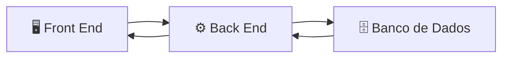
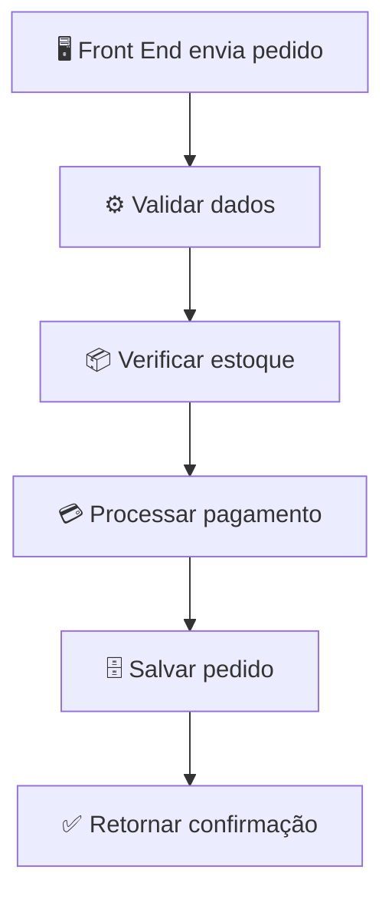

# **Back End**

O **Back End** é a camada de uma aplicação responsável pela **lógica de negócio, processamento de dados e comunicação com o banco de dados e outros serviços**. É a parte que executa no servidor e normalmente não é visível para o usuário.

Em um e-commerce, por exemplo, o Back End é responsável por:

* Autenticar usuários.
* Gerenciar produtos e categorias.
* Processar carrinhos de compras.
* Registrar pedidos.
* Controlar o estoque.
* Integrar com serviços de pagamento.
* Calcular fretes.
* Armazenar e recuperar dados do banco de dados.

O Front End envia solicitações ao Back End por meio de APIs, e o Back End processa essas solicitações antes de retornar uma resposta.

## Como o Back End funciona

Por exemplo, quando um cliente finaliza uma compra:

1. O Front End envia os dados do pedido ao Back End.
2. O Back End valida as informações recebidas.
3. Verifica se há estoque disponível.
4. Calcula o valor total da compra.
5. Processa o pagamento.
6. Registra o pedido no banco de dados.
7. Retorna ao Front End a confirmação da compra.

## Como o Back End pode ser desenvolvido

Existem diversas linguagens e frameworks para desenvolver aplicações Back End.

### 1. Java

Muito utilizada em sistemas corporativos e aplicações de grande porte.

Alguns frameworks:

* Spring Boot
* Jakarta EE

---

### 2. C#

Amplamente utilizado em aplicações empresariais.

Framework:

* ASP.NET Core

---

### 3. JavaScript / TypeScript

Permite desenvolver aplicações Back End utilizando a mesma linguagem do Front End.

Frameworks:

* Node.js
* Express
* NestJS

---

### 4. Python

Conhecida pela simplicidade da linguagem e grande ecossistema.

Frameworks:

* Django
* Flask
* FastAPI

---

### 5. PHP

Muito utilizado em aplicações web.

Frameworks:

* Laravel
* Symfony

---

### 6. Go

Destaca-se pelo desempenho e simplicidade, sendo bastante utilizado em APIs e microsserviços.

Frameworks:

* Gin
* Fiber

---

### 7. Rust

Voltada para aplicações de alto desempenho e segurança de memória.

Frameworks:

* Actix Web
* Axum

## Responsabilidades do Back End

* Implementar as regras de negócio.
* Expor APIs para consumo pelo Front End.
* Validar dados recebidos.
* Gerenciar autenticação e autorização.
* Acessar bancos de dados.
* Integrar com serviços externos (pagamentos, e-mails, logística etc.).
* Registrar logs e monitorar a aplicação.
* Garantir a segurança e a integridade dos dados.

## Exemplo de processamento de um pedido

## Resumo

O Back End é a camada responsável pelo funcionamento interno da aplicação. Ele recebe requisições do Front End, aplica as regras de negócio, acessa o banco de dados, integra-se a serviços externos e devolve as respostas necessárias. Pode ser desenvolvido em diversas linguagens, como Java, C#, JavaScript/TypeScript, Python, PHP, Go ou Rust, utilizando frameworks que facilitam a criação de APIs e aplicações robustas.
