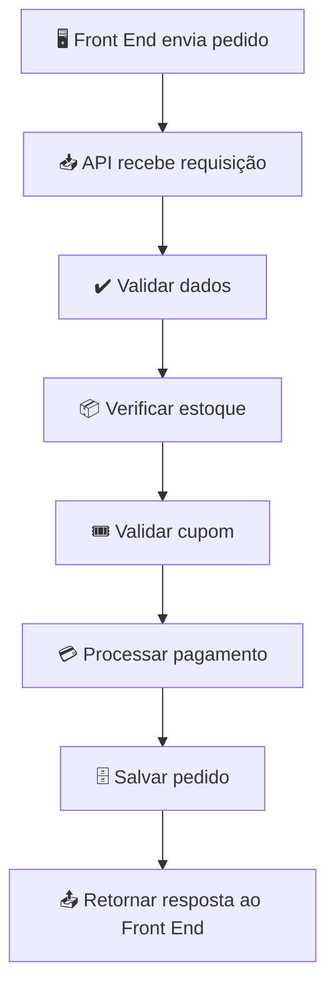

# Regras de Negócio 

As **regras de negócio** são as instruções que definem **como a aplicação deve se comportar**. Elas representam as políticas, restrições e processos do domínio do sistema.

Em um e-commerce, essas regras normalmente são implementadas no **Back End (API)**, pois precisam ser aplicadas independentemente do Front End utilizado (site, aplicativo móvel ou outro cliente).

## Exemplos de regras de negócio

### Cadastro de usuários

* O e-mail deve ser único.
* A senha deve atender aos requisitos mínimos de segurança.
* Apenas usuários autenticados podem alterar seus dados.

---

### Produtos

* Um produto não pode ter preço negativo.
* Produtos inativos não podem ser vendidos.
* Apenas administradores podem cadastrar ou excluir produtos.

---

### Estoque

* Não permitir compras acima da quantidade disponível.
* Reduzir o estoque após a confirmação do pagamento.
* Repor o estoque em caso de cancelamento do pedido.

---

### Carrinho de compras

* Não permitir quantidade menor que 1.
* Atualizar automaticamente o valor total ao alterar a quantidade.
* Remover produtos indisponíveis do carrinho.

---

### Pedidos

* Um pedido só pode ser enviado após a confirmação do pagamento.
* Um pedido cancelado não pode voltar para o status "Em processamento".
* Não permitir alteração do pedido após o envio.

---

### Pagamentos

* Confirmar o pagamento antes de registrar o pedido como pago.
* Rejeitar pagamentos recusados pela operadora.
* Registrar todas as tentativas de pagamento.

---

### Promoções e cupons

* Um cupom só pode ser utilizado dentro do período de validade.
* Um cupom pode ser limitado a um uso por cliente.
* Não permitir combinar cupons incompatíveis.

---

### Frete

* Calcular o frete de acordo com CEP, peso e dimensões.
* Oferecer frete grátis acima de um valor mínimo.
* Não permitir entrega em regiões não atendidas.

---

### Segurança

* Exigir autenticação para acessar pedidos.
* Permitir que um cliente visualize apenas seus próprios pedidos.
* Registrar ações importantes em logs.

## Exemplo de fluxo de regras de negócio



## Exemplo prático

Imagine que um cliente tente comprar **5 unidades** de um produto, mas existam apenas **3 em estoque**.

O Front End envia a solicitação:

```text
Produto: Notebook
Quantidade: 5
```

A API executa as regras de negócio:

1. Verifica se o usuário está autenticado.
2. Confirma que o produto existe.
3. Consulta o estoque.
4. Detecta que há apenas 3 unidades disponíveis.
5. Interrompe o processamento.
6. Retorna uma resposta informando que não há estoque suficiente.

Nesse caso, quem decide se a compra pode ou não ser realizada é a **API**, não o Front End.

## Resumo

As regras de negócio implementam a lógica da aplicação e garantem que ela funcione conforme os requisitos definidos. Em um e-commerce, elas abrangem validações de usuários, produtos, estoque, pedidos, pagamentos, cupons e frete. Centralizar essas regras na API garante que todos os clientes (web, mobile ou integrações externas) sigam as mesmas políticas de funcionamento.
