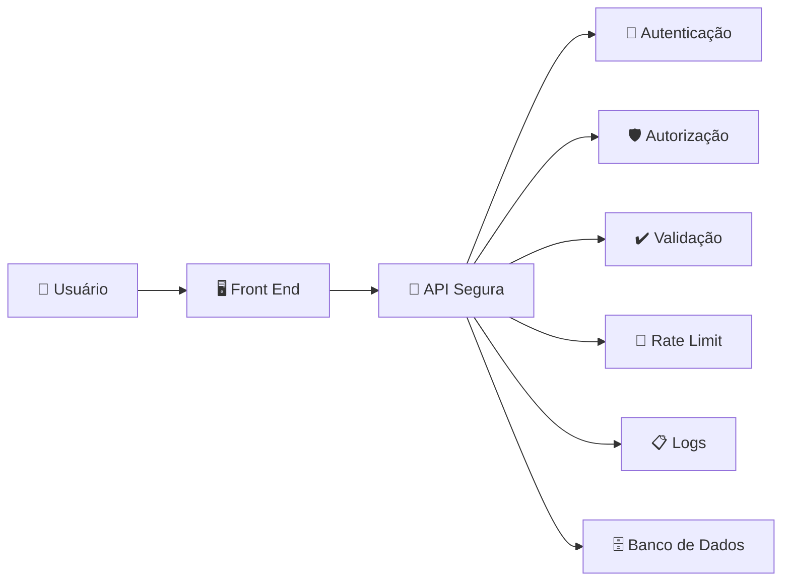

# **Segurança**

A segurança de uma **API** é fundamental porque ela é a porta de comunicação entre o Front End, sistemas externos e os dados da aplicação. Em um e-commerce, uma API insegura pode expor dados de clientes, permitir compras indevidas ou comprometer informações financeiras.

Os principais pontos de atenção são:

## 1. Autenticação e autorização

A API deve saber **quem está fazendo uma requisição** e **o que essa pessoa pode fazer**.

### Autenticação

Confirma a identidade do usuário.

Exemplos:

* Login com usuário e senha.
* Tokens de acesso (JWT, OAuth2).
* Integração com provedores de identidade.

Exemplo:

```text
POST /login

Usuário envia:
email + senha

API retorna:
token de acesso
```

### Autorização

Define as permissões do usuário.

Exemplo:

```text
Cliente:
- Ver seus pedidos
- Criar compras

Administrador:
- Cadastrar produtos
- Alterar preços
- Gerenciar estoque
```

Um cliente não deve conseguir chamar:

```text
PUT /produtos/123/preco
```

apenas alterando a URL.

---

# 2. Nunca confiar no Front End

O Front End está sob controle do usuário e pode ser manipulado.

Uma validação como:

```javascript
if (quantidade <= estoque) {
   permitirCompra();
}
```

no Front End **não é suficiente**.

A API precisa validar novamente:

```text
Quantidade solicitada: 10

Estoque disponível: 3

Resultado:
❌ Compra recusada
```

Todas as regras importantes devem existir no Back End.

---

# 3. Validar todas as entradas

Nunca confiar nos dados enviados pelo cliente.

Exemplos de validação:

* Tipo de dado correto.
* Tamanho máximo.
* Formato esperado.
* Valores permitidos.

Exemplo:

Entrada recebida:

```json
{
  "preco": -500
}
```

A API deve rejeitar:

```json
{
  "erro": "Preço inválido"
}
```

---

# 4. Proteção contra SQL Injection

Um invasor pode tentar manipular consultas ao banco.

Exemplo perigoso:

```sql
SELECT * FROM usuarios
WHERE email = 'entrada_usuario'
```

Se a entrada não for tratada, pode permitir consultas indevidas.

Boas práticas:

* Usar consultas parametrizadas.
* Utilizar ORM com segurança.
* Nunca concatenar strings SQL manualmente.

---

# 5. Criptografia dos dados

### Comunicação

Sempre utilizar:

```text
HTTPS
```

para impedir interceptação de dados.

### Senhas

Nunca armazenar:

```text
senha = "123456"
```

O correto:

```text
senha = hash(senha)
```

Usando algoritmos como:

* bcrypt
* Argon2
* PBKDF2

---

# 6. Controle de acesso aos dados

Evitar exposição de informações sensíveis.

Exemplo de problema:

Requisição:

```http
GET /usuarios/100/pedidos
```

A API deve verificar:

```text
Usuário autenticado:
João

Pedido pertence a:
Maria

Resultado:
❌ Acesso negado
```

Esse tipo de falha é conhecido como **Broken Access Control**.

---

# 7. Limitação de requisições (Rate Limiting)

Evita abuso da API.

Exemplo:

Sem proteção:

```text
Atacante:
100.000 tentativas de login
```

Com proteção:

```text
5 tentativas por minuto

Depois:
bloqueio temporário
```

Protege contra:

* Ataques de força bruta.
* Bots.
* Sobrecarga do sistema.

---

# 8. Gerenciamento seguro de tokens

Cuidados:

* Definir tempo de expiração.
* Permitir renovação segura.
* Revogar tokens quando necessário.
* Não colocar informações sensíveis dentro do JWT.

Exemplo:

```json
{
  "userId": 123,
  "role": "cliente",
  "exp": 1720000000
}
```

---

# 9. Tratamento de erros

Evitar retornar detalhes internos.

Ruim:

```json
{
 "erro": "Falha SQL na tabela usuarios linha 52"
}
```

Bom:

```json
{
 "erro": "Erro interno do servidor"
}
```

Os detalhes devem ficar apenas nos logs internos.

---

# 10. Logs e monitoramento

Registrar eventos importantes:

* Login realizado.
* Tentativas inválidas.
* Alteração de produtos.
* Alteração de permissões.
* Falhas de pagamento.

Exemplo:

```text
2026-07-30 10:30
Usuário admin alterou preço do produto 123
```

---

# 11. Proteção de informações sensíveis

Nunca retornar dados desnecessários.

Evitar:

```json
{
 "nome": "João",
 "email": "joao@email.com",
 "senhaHash": "abc123",
 "cartao": "411111..."
}
```

Retornar apenas o necessário:

```json
{
 "nome": "João"
}
```

---

# 12. Configuração segura da API

Cuidados:

* Não deixar senhas no código.
* Usar variáveis de ambiente.
* Manter dependências atualizadas.
* Desabilitar endpoints de teste em produção.

Exemplo:

Errado:

```javascript
const senhaBanco = "senha123";
```

Correto:

```javascript
const senhaBanco = process.env.DB_PASSWORD;
```

---

## Visão geral da segurança de uma API



## Checklist básico para uma API de e-commerce

✅ HTTPS habilitado
✅ Autenticação com tokens seguros
✅ Controle de permissões
✅ Validação no Back End
✅ Proteção contra SQL Injection
✅ Senhas com hash forte
✅ Rate limiting
✅ Logs de auditoria
✅ Dados sensíveis protegidos
✅ Dependências atualizadas

Uma API bem projetada segue o princípio: **o cliente solicita, mas a API decide se a operação é permitida**.
