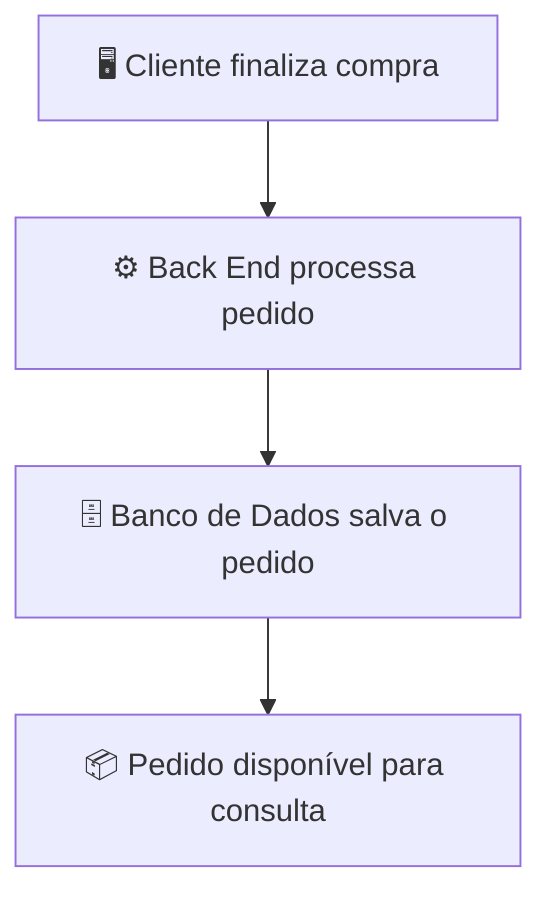

# Banco de Dados

O **Banco de Dados** é o componente responsável por **armazenar, organizar e recuperar as informações** de uma aplicação. Ele permite que os dados sejam persistidos, ou seja, permaneçam disponíveis mesmo após o encerramento da aplicação.

Em um e-commerce, por exemplo, o banco de dados armazena informações como:

* Clientes.
* Produtos.
* Categorias.
* Estoque.
* Pedidos.
* Pagamentos.
* Endereços de entrega.

O Back End é responsável por acessar o banco de dados para inserir, consultar, atualizar e remover essas informações.

## Como o Banco de Dados funciona


Por exemplo, quando um cliente consulta um produto:

1. O Front End solicita os dados ao Back End.
2. O Back End consulta o banco de dados.
3. O banco retorna as informações do produto.
4. O Back End envia os dados ao Front End.
5. O Front End exibe as informações ao usuário.

## Como um Banco de Dados pode ser desenvolvido

Embora seja comum dizer "desenvolver um banco de dados", na prática o desenvolvimento consiste em **projetar e implementar sua estrutura**. Isso inclui definir quais informações serão armazenadas, como elas se relacionam e como serão acessadas de forma eficiente.

As principais etapas são:

### 1. Modelagem de Dados

É a fase de planejamento, em que são identificadas as entidades da aplicação e seus relacionamentos.

Exemplo para um e-commerce:

```text
Cliente
Produto
Pedido
ItemPedido
Categoria
```

Essa modelagem geralmente é representada por diagramas, como o Modelo Entidade-Relacionamento (MER).

---

### 2. Criação das Tabelas ou Coleções

Após a modelagem, a estrutura é implementada no banco de dados.

Em bancos relacionais, criam-se **tabelas**, por exemplo:

* Cliente
* Produto
* Pedido
* ItemPedido

Em bancos NoSQL, criam-se **coleções** ou documentos.

---

### 3. Definição dos Relacionamentos

Em bancos relacionais, as tabelas são conectadas por chaves primárias e estrangeiras.

Exemplo:

```text
Cliente
 └── Pedido
       └── ItemPedido
             └── Produto
```

Esses relacionamentos garantem a integridade dos dados.

---

### 4. Manipulação dos Dados

O Back End realiza operações no banco por meio de comandos como:

* Inserir registros.
* Consultar informações.
* Atualizar dados.
* Remover registros.

Essas operações são conhecidas como operações **CRUD** (*Create, Read, Update, Delete*).

## Tipos de Banco de Dados

### Bancos Relacionais (SQL)

Organizam os dados em tabelas relacionadas entre si.

Exemplos:

* PostgreSQL
* MySQL
* MariaDB
* SQL Server
* Oracle Database

São indicados quando a consistência dos dados e os relacionamentos são importantes, como em sistemas financeiros e e-commerces.

---

### Bancos Não Relacionais (NoSQL)

Armazenam dados em formatos diferentes, como documentos, chave-valor, grafos ou colunas.

Exemplos:

* MongoDB
* Redis
* Cassandra
* Neo4j

São úteis para aplicações que precisam de alta escalabilidade ou lidam com grandes volumes de dados não estruturados.

## Responsabilidades do Banco de Dados

* Armazenar informações de forma persistente.
* Garantir a integridade dos dados.
* Permitir consultas rápidas e eficientes.
* Controlar acessos simultâneos.
* Oferecer mecanismos de backup e recuperação.
* Manter relacionamentos entre os dados (nos bancos relacionais).

## Exemplo de fluxo de armazenamento de um pedido



## Resumo

O Banco de Dados é a camada responsável por armazenar e organizar as informações da aplicação de forma persistente. Seu desenvolvimento envolve modelar os dados, criar a estrutura de armazenamento, definir relacionamentos e garantir consultas eficientes. Em aplicações como e-commerces, o banco de dados trabalha em conjunto com o Back End para registrar clientes, produtos, pedidos e demais informações necessárias ao funcionamento do sistema.


