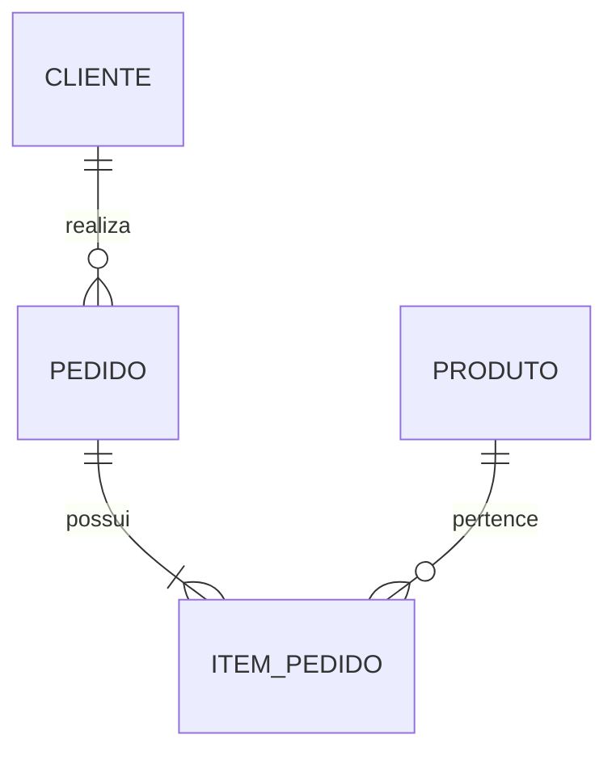
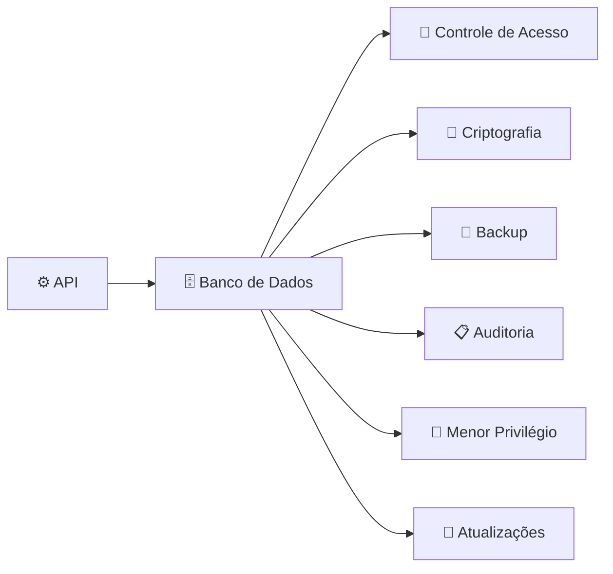

A segurança do **Banco de Dados** é tão importante quanto a segurança da API, pois ele normalmente contém as informações mais valiosas da aplicação: dados de clientes, pedidos, pagamentos, produtos e configurações internas.

Em um e-commerce, um vazamento ou alteração indevida no banco pode causar perda financeira, exposição de dados pessoais e comprometimento de toda a operação.

Os principais pontos de atenção são:

---

## 1. Controle de acesso ao banco

Nem toda aplicação ou usuário deve ter acesso total ao banco.

Exemplo de permissões:

```text
Administrador do Banco:
- Criar tabelas
- Alterar estrutura
- Gerenciar usuários

Aplicação:
- Ler produtos
- Criar pedidos
- Atualizar estoque

Usuário de relatório:
- Apenas consultar dados
```

Evite usar um usuário administrador (`root`, `postgres`, etc.) pela aplicação.

Exemplo ruim:

```text
Aplicação
    |
    ▼
Banco de Dados
    |
Usuário administrador
```

Melhor:

```text
Aplicação
    |
    ▼
Banco de Dados
    |
Usuário com permissões limitadas
```

---

# 2. Proteger as credenciais

Nunca deixar usuário e senha do banco diretamente no código.

Evitar:

```javascript
const databasePassword = "senha123";
```

Usar:

```text
Variáveis de ambiente
Secrets Manager
Cofres de credenciais
```

Exemplo:

```text
DB_HOST=servidor
DB_USER=app_user
DB_PASSWORD=********
```

---

# 3. Criptografar dados sensíveis

Algumas informações precisam de proteção adicional.

Exemplos:

* Dados pessoais.
* Documentos de identificação.
* Endereços.
* Informações financeiras.

Possíveis proteções:

* Criptografia em repouso (*at rest*).
* Criptografia em trânsito.
* Chaves de criptografia gerenciadas com segurança.

---

# 4. Nunca armazenar senhas em texto puro

Errado:

```text
Tabela Usuario

id | email | senha
1  | joao@email.com | 123456
```

Correto:

```text
Tabela Usuario

id | email | senha_hash
1  | joao@email.com | $argon2id$...
```

Usar algoritmos apropriados:

* Argon2.
* bcrypt.
* PBKDF2.

---

# 5. Evitar SQL Injection

Mesmo sendo uma preocupação da API, o banco também deve ser protegido.

Evitar consultas montadas manualmente:

```sql
SELECT * FROM clientes
WHERE nome = 'entrada_usuario';
```

Preferir:

* Queries parametrizadas.
* ORM seguro.
* Stored procedures quando aplicável.

---

# 6. Backup e recuperação

Um banco seguro precisa conseguir se recuperar de problemas.

Ter:

* Backups automáticos.
* Testes de restauração.
* Cópias em locais diferentes.
* Política de retenção.

Exemplo:

```text
Banco principal
       |
       ▼
Backup diário
       |
       ▼
Backup externo
```

Um backup que nunca foi testado pode não funcionar quando necessário.

---

# 7. Controle de alterações

Alterações na estrutura do banco devem ser rastreáveis.

Exemplo:

```text
2026-07-30
Usuário: desenvolvedor
Alteração:
Criada coluna "status_pagamento"
```

Ferramentas comuns:

* Migrations.
* Controle de versão.
* Auditoria.

---

# 8. Separar ambientes

Não usar o mesmo banco para tudo.

Evitar:

```text
Desenvolvimento
      |
      ▼
Banco de Produção
```

Melhor:

```text
Desenvolvimento → Banco Dev

Testes → Banco Homologação

Produção → Banco Produção
```

---

# 9. Monitorar acessos

Registrar atividades importantes:

* Login no banco.
* Consultas sensíveis.
* Alterações de dados.
* Exclusões.

Exemplo:

```text
2026-07-30 08:30

Usuário:
admin_api

Ação:
UPDATE produto

Registro:
ID 123
```

---

# 10. Aplicar princípio do menor privilégio

Cada usuário deve ter apenas as permissões necessárias.

Exemplo:

Usuário da API:

```sql
GRANT SELECT ON produtos;
GRANT INSERT ON pedidos;
GRANT UPDATE ON estoque;
```

Evitar:

```sql
GRANT ALL PRIVILEGES;
```

---

# 11. Atualizar o banco e componentes

Manter atualizado:

* Sistema operacional.
* Servidor do banco.
* Drivers.
* Bibliotecas de conexão.

Atualizações corrigem vulnerabilidades conhecidas.

---

# 12. Proteger contra exclusão ou alteração acidental

Algumas estratégias:

* Soft delete.
* Auditoria.
* Confirmação de operações críticas.
* Restrição de permissões.

Exemplo:

Em vez de:

```sql
DELETE FROM produto WHERE id = 10;
```

usar:

```text
Produto:
status = INATIVO
```

Mantendo o histórico.

---

# 13. Modelar os dados corretamente

Uma boa modelagem reduz riscos e erros.

Exemplo:



Isso evita:

* Dados duplicados.
* Inconsistências.
* Informações órfãs.

---

# Visão geral da segurança do Banco de Dados



---

## Checklist básico para um Banco de Dados de e-commerce

✅ Usuários de banco com permissões limitadas
✅ Senhas armazenadas com hash seguro
✅ Comunicação criptografada
✅ Backups automáticos testados
✅ Logs de auditoria
✅ Separação de ambientes
✅ Controle de alterações (migrations)
✅ Proteção contra SQL Injection
✅ Dados sensíveis criptografados
✅ Monitoramento de acessos

Em resumo: **a API deve controlar quem pode acessar os dados, e o Banco de Dados deve garantir que, mesmo em caso de falha ou acesso indevido, os dados permaneçam protegidos, íntegros e recuperáveis.**
