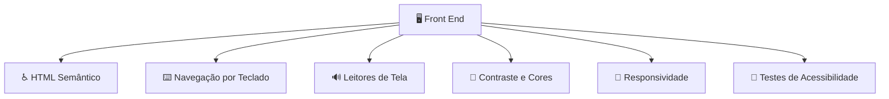

A **acessibilidade no Front End (FE)** consiste em desenvolver a interface para que **todas as pessoas consigam utilizar a aplicação**, incluindo pessoas com deficiências visuais, auditivas, motoras, cognitivas ou limitações temporárias.

Em um e-commerce, isso significa que uma pessoa deve conseguir pesquisar produtos, adicionar itens ao carrinho e finalizar uma compra independentemente da forma como interage com o sistema.

As principais implementações são:

---

## 1. HTML semântico

Usar elementos HTML pelo significado correto, em vez de apenas elementos genéricos.

Evitar:

```html
<div onclick="comprar()">
  Comprar
</div>
```

Preferir:

```html
<button onclick="comprar()">
  Comprar
</button>
```

Elementos semânticos ajudam leitores de tela a entenderem a estrutura:

```html
<header>
<nav>
<main>
<section>
<footer>
<button>
<form>
<label>
```

---

# 2. Compatibilidade com leitores de tela

Pessoas com deficiência visual podem utilizar ferramentas como leitores de tela.

Boas práticas:

* Usar textos alternativos em imagens.
* Criar títulos claros.
* Informar corretamente campos de formulário.

Exemplo:

Ruim:

```html

```

Melhor:

```html

```

---

# 3. Navegação por teclado

A aplicação deve funcionar sem mouse.

O usuário deve conseguir:

* Navegar com `TAB`.
* Abrir menus.
* Preencher formulários.
* Finalizar compras.

Exemplo:

```text
TAB
 ↓
Campo busca
 ↓
Produto
 ↓
Adicionar ao carrinho
 ↓
Finalizar compra
```

Evitar remover o foco:

```css
button:focus {
    outline: none;
}
```

---

# 4. Contraste de cores

Textos precisam ter contraste suficiente com o fundo.

Problema:

```text
Texto cinza claro
+
Fundo branco
=
Difícil leitura
```

Melhor:

```text
Texto escuro
+
Fundo claro
=
Maior legibilidade
```

Também evitar transmitir informações apenas por cor:

Ruim:

```text
🔴 Produto indisponível
🟢 Produto disponível
```

Melhor:

```text
🔴 Produto indisponível

Status: Indisponível
```

---

# 5. Tamanho e legibilidade dos textos

Permitir:

* Zoom do navegador.
* Ajuste de tamanho de fonte.
* Boa hierarquia visual.

Evitar:

```css
body {
    font-size: 10px;
}
```

Preferir unidades flexíveis:

```css
body {
    font-size: 1rem;
}
```

---

# 6. Formulários acessíveis

Formulários são críticos em e-commerce.

Ruim:

```html
<input placeholder="Email">
```

Melhor:

```html
<label for="email">
  Email
</label>

<input 
 id="email"
 type="email">
```

Também informar erros claramente:

```text
❌ Email inválido

Digite um endereço como:
usuario@email.com
```

---

# 7. Uso correto de ARIA

ARIA (*Accessible Rich Internet Applications*) adiciona informações para tecnologias assistivas.

Exemplo:

```html
<button aria-label="Adicionar notebook ao carrinho">
    +
</button>
```

Mas a regra é:

> Primeiro usar HTML semântico. ARIA deve complementar, não substituir.

---

# 8. Imagens e conteúdo visual

Toda imagem importante deve possuir descrição.

Produto:

```html

```

Imagem apenas decorativa:

```html

```

---

# 9. Feedback para ações do usuário

O usuário precisa saber o que aconteceu.

Exemplo:

Ao adicionar ao carrinho:

Ruim:

```text
Nada acontece visualmente.
```

Melhor:

```text
✅ Produto adicionado ao carrinho
```

Para leitores de tela:

```html
<div aria-live="polite">
 Produto adicionado ao carrinho
</div>
```

---

# 10. Estados dos componentes

Componentes precisam informar seus estados.

Exemplo:

Menu aberto:

```html
<button aria-expanded="true">
 Menu
</button>
```

Campo desabilitado:

```html
<input disabled>
```

Carregamento:

```html
<div aria-busy="true">
 Carregando produtos...
</div>
```

---

# 11. Layout responsivo

A interface deve funcionar em:

* Computadores.
* Tablets.
* Celulares.
* Diferentes resoluções.

Exemplo:

```text
Desktop:
[Produto] [Produto] [Produto]

Mobile:
[Produto]
[Produto]
[Produto]
```

---

# 12. Evitar animações problemáticas

Algumas pessoas podem ter desconforto com movimentos intensos.

Permitir redução:

```css
@media (prefers-reduced-motion: reduce) {
  * {
    animation: none;
  }
}
```

---

# 13. Testes de acessibilidade

Ferramentas úteis:

* Lighthouse (Chrome).
* Axe DevTools.
* WAVE.
* Testes com leitores de tela.

Também é importante testar:

* Apenas teclado.
* Zoom de 200%.
* Diferentes leitores de tela.

---

# Exemplo de arquitetura de acessibilidade no Front End



---

## Checklist de acessibilidade para um e-commerce

✅ HTML semântico
✅ Navegação completa por teclado
✅ Imagens com texto alternativo
✅ Formulários com labels
✅ Contraste adequado de cores
✅ Compatibilidade com leitores de tela
✅ Mensagens de erro claras
✅ Foco visual nos elementos
✅ Layout responsivo
✅ Testes automatizados e manuais

Em resumo: **um Front End acessível não é apenas uma interface bonita; é uma interface que permite que diferentes pessoas consigam perceber, navegar, entender e interagir com o sistema.** A implementação normalmente segue as recomendações do padrão internacional **WCAG (Web Content Accessibility Guidelines)**.
