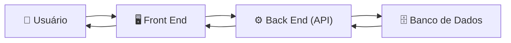

#  **Front End** 

O **Front End** é a camada de uma aplicação responsável pela **interface com o usuário**. É a parte que o cliente vê e utiliza para interagir com o sistema, seja em um navegador, aplicativo móvel ou desktop.

Em um e-commerce, por exemplo, o Front End é responsável por exibir:

* Página inicial.
* Catálogo de produtos.
* Página de detalhes de um produto.
* Carrinho de compras.
* Tela de login.
* Checkout.
* Histórico de pedidos.

O Front End não implementa regras de negócio complexas nem acessa diretamente o banco de dados. Em vez disso, ele envia requisições ao Back End por meio de APIs e apresenta as respostas ao usuário.

## Como o Front End funciona

Por exemplo, quando um usuário acessa um produto:

1. O usuário abre a página do produto.
2. O Front End solicita os dados ao Back End.
3. O Back End consulta o banco de dados.
4. Os dados retornam ao Front End.
5. O Front End exibe nome, preço, imagens e descrição do produto.

## Como o Front End pode ser desenvolvido

Existem diferentes formas de desenvolver um Front End, dependendo da complexidade da aplicação.

### 1. HTML, CSS e JavaScript

É a forma mais básica e serve de base para qualquer aplicação web.

* **HTML:** define a estrutura da página.
* **CSS:** controla a aparência e o layout.
* **JavaScript:** adiciona comportamento e interatividade.

Essa abordagem é adequada para sites simples e aplicações de pequeno porte.

---

### 2. Frameworks e bibliotecas JavaScript

Em aplicações maiores, é comum utilizar ferramentas que facilitam o desenvolvimento de interfaces mais complexas.

Alguns exemplos são:

* React
* Angular
* Vue.js
* Svelte

Essas tecnologias permitem criar componentes reutilizáveis, gerenciar estados da aplicação e construir interfaces mais dinâmicas.

---

### 3. Frameworks Full Stack

Alguns frameworks integram Front End e Back End no mesmo projeto, como:

* Next.js
* Nuxt
* Remix

Eles permitem renderização no servidor, geração de páginas estáticas e consumo de APIs em uma única aplicação.

---

### 4. Aplicações Mobile

O Front End também pode ser desenvolvido para dispositivos móveis utilizando tecnologias como:

* React Native
* Flutter
* Kotlin (Android)
* Swift (iOS)

Embora executem em celulares, essas aplicações normalmente consomem as mesmas APIs utilizadas pelas versões web.

## Responsabilidades do Front End

* Exibir informações ao usuário.
* Receber entradas (cliques, formulários, pesquisas).
* Validar dados básicos antes do envio.
* Consumir APIs do Back End.
* Exibir mensagens de erro e sucesso.
* Controlar a navegação entre telas.
* Gerenciar autenticação do usuário (como armazenar um token de sessão).

## Resumo

O Front End é a camada responsável pela experiência do usuário. Seu papel é apresentar informações e permitir a interação com a aplicação, comunicando-se com o Back End por meio de APIs. Ele pode ser desenvolvido desde páginas simples com HTML, CSS e JavaScript até aplicações modernas utilizando frameworks como React, Angular ou Vue, além de tecnologias para dispositivos móveis.
