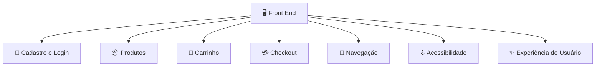

# Regras de Negócio 

As **regras de negócio no Front End (FE)** são as validações e comportamentos que melhoram a experiência do usuário e evitam erros antes de enviar informações para a API.

Porém, existe uma regra importante de arquitetura:

> **O Front End pode aplicar regras para experiência do usuário, mas a validação definitiva deve sempre existir no Back End.**

O motivo é que o usuário pode manipular o Front End (alterar JavaScript, chamadas de rede, requisições etc.). A API é a autoridade final.

Exemplo:

```text
Front End:
"Vou bloquear compra acima do estoque para evitar erro ao usuário"

Back End:
"Vou validar novamente porque a regra de estoque pertence ao servidor"
```

---

# 1. Regras de cadastro de usuário

## Validar campos obrigatórios

```text
Regra:
Nome, email e senha são obrigatórios.
```

Comportamento esperado:

```gherkin
Scenario: Usuário tenta cadastrar sem preencher email
  Given que o usuário está na tela de cadastro
  When ele deixa o campo email vazio
  And tenta enviar o formulário
  Then o sistema deve impedir o envio
  And exibir "Email obrigatório"
```

---

## Validar formato do email

```text
Regra:
O email deve possuir formato válido.
```

Exemplo:

Aceitar:

```text
cliente@email.com
```

Recusar:

```text
cliente@email
```

---

## Validar senha

Exemplos:

* Mínimo de caracteres.
* Exigir combinação de caracteres.
* Mostrar força da senha.

```text
Senha:
❌ 123
⚠️ Senha fraca
✅ MinhaSenha@123
```

---

# 2. Regras de login

## Campos obrigatórios

```text
Regra:
Usuário deve informar email e senha.
```

---

## Controle de tentativa

Exemplo:

```text
Tentativa 1:
Senha inválida

Tentativa 5:
Exibir aviso:
"Verifique seus dados"
```

Observação: o bloqueio real deve ser feito pela API.

---

## Sessão do usuário

```text
Regra:
Usuário autenticado deve visualizar áreas privadas.
```

Exemplo:

```text
Sem login:
 /meus-pedidos

Resultado:
Redirecionar para /login
```

---

# 3. Regras de catálogo de produtos

## Exibir somente produtos disponíveis

```text
Regra:
Produtos inativos não devem aparecer para compra.
```

---

## Formatação de valores

Entrada da API:

```json
{
 "preco": 1999.9
}
```

Exibição:

```text
R$ 1.999,90
```

---

## Ordenação e filtros

Exemplos:

```text
Usuário seleciona:

Preço menor → maior

Resultado:
Produtos ordenados pelo menor preço
```

---

# 4. Regras do carrinho

## Adicionar produto

```text
Regra:
Produto disponível pode ser adicionado.
```

Fluxo:

```text
Produto
 ↓
Adicionar ao carrinho
 ↓
Atualizar quantidade
 ↓
Atualizar total
```

---

## Limite de quantidade

Exemplo:

```text
Estoque disponível:
5 unidades

Usuário tenta:
Quantidade 10

FE:
Exibir aviso:
"Quantidade máxima disponível: 5"
```

A API deve validar novamente.

---

## Cálculo do total

Exemplo:

```text
Produto:
R$100

Quantidade:
3

Total:
R$300
```

---

# 5. Regras de checkout

## Não permitir finalizar carrinho vazio

```gherkin
Scenario: Usuário tenta finalizar compra sem produtos
  Given que o carrinho está vazio
  When o usuário clica em finalizar compra
  Then o sistema deve impedir a ação
  And exibir "Adicione produtos ao carrinho"
```

---

## Validar endereço

```text
Regra:
Para comprar, usuário precisa informar endereço.
```

Campos:

* CEP.
* Rua.
* Número.
* Cidade.
* Estado.

---

## Seleção de pagamento

Exemplo:

```text
Disponíveis:

☑ PIX
☑ Cartão
☑ Boleto
```

Regra:

```text
Usuário deve selecionar uma opção.
```

---

# 6. Regras de mensagens ao usuário

O Front End deve transformar respostas técnicas em mensagens claras.

API retorna:

```json
{
 "error": "INSUFFICIENT_STOCK"
}
```

FE exibe:

```text
"Quantidade disponível menor que a solicitada."
```

---

# 7. Regras de navegação

Exemplos:

## Usuário não autenticado

```text
Acessa:

/checkout

Resultado:

/login
```

---

## Usuário autenticado

```text
Acessa:

/minha-conta

Resultado:

Exibir dados pessoais
```

---

# 8. Regras de acessibilidade

O FE deve garantir:

* Campos com labels.
* Navegação por teclado.
* Mensagens de erro acessíveis.
* Contraste adequado.
* Textos alternativos.

Exemplo:

```text
Imagem do produto:

Alt:
"Notebook Dell Inspiron 15"
```

---

# 9. Regras de responsividade

A aplicação deve funcionar em diferentes telas.

Exemplo:

```text
Desktop:

[Produto] [Produto] [Produto]


Mobile:

[Produto]

[Produto]

[Produto]
```

---

# 10. Regras de estado da aplicação

O Front End deve controlar estados como:

## Carregando

```text
Buscando produtos...

⏳ Loading
```

## Sucesso

```text
Produto carregado
```

## Erro

```text
Não foi possível carregar produtos.
Tente novamente.
```

---

# Visão geral das regras de negócio no FE



---

## Resumo das principais regras de negócio do FE

| Área           | Regras                              |
| -------------- | ----------------------------------- |
| Cadastro       | Campos obrigatórios, formato, senha |
| Login          | Validação, sessão, mensagens        |
| Produtos       | Busca, filtros, exibição            |
| Carrinho       | Quantidade, total, remoção          |
| Checkout       | Endereço, pagamento, confirmação    |
| Segurança      | Controle de acesso visual           |
| UX             | Feedback, loading, erros            |
| Acessibilidade | Teclado, leitores de tela           |
| Responsividade | Desktop e mobile                    |

Em uma arquitetura profissional, a divisão normalmente fica assim:

```text
Front End:
- Validação de entrada
- Experiência do usuário
- Navegação
- Feedback visual

API:
- Regras de negócio oficiais
- Segurança
- Permissões
- Processamento

Banco:
- Integridade
- Persistência
- Consistência dos dados
```

Essa separação evita que a aplicação dependa apenas do Front End para garantir o funcionamento correto.
