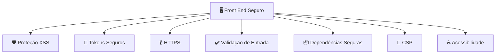

# Segurança

A **segurança no Front End (FE)** envolve proteger a aplicação no lado do cliente, reduzir riscos de manipulação da interface, proteger dados sensíveis e garantir uma comunicação segura com a API.

É importante lembrar:

> **O Front End não é um ambiente confiável.** Todo código JavaScript, HTML e CSS entregue ao navegador pode ser analisado e alterado pelo usuário. Portanto, o FE deve aplicar boas práticas de segurança, mas a proteção real deve estar no Back End e no Banco de Dados.

Exemplo:

```text
Usuário altera o JavaScript:

preco = 100
↓
preco = 1

Resultado:
O FE pode ser manipulado.

Proteção:
A API deve validar o preço real.
```

---

# 1. Não armazenar informações sensíveis

Nunca guardar no Front End:

❌ Senhas
❌ Chaves privadas
❌ Tokens administrativos
❌ Credenciais de banco de dados
❌ Chaves secretas de APIs externas

Exemplo errado:

```javascript
const apiSecret = "MINHA_CHAVE_PRIVADA";
```

O código enviado ao navegador pode ser visualizado.

---

# 2. Armazenamento seguro de tokens

Quando um usuário faz login, a API retorna uma forma de autenticação.

Evitar:

```javascript
localStorage.setItem(
 "token",
 token
);
```

O `localStorage` pode ser acessado por scripts maliciosos caso exista uma vulnerabilidade XSS.

Preferível:

```text
Cookie HTTP Only + Secure + SameSite
```

Características:

* **HttpOnly:** JavaScript não consegue ler o cookie.
* **Secure:** envia apenas via HTTPS.
* **SameSite:** reduz ataques CSRF.

---

# 3. Proteção contra XSS (Cross-Site Scripting)

XSS acontece quando um invasor consegue executar scripts dentro da aplicação.

Exemplo perigoso:

Usuário cadastra:

```html
<script>
alert("ataque")
</script>
```

A aplicação exibe diretamente:

```html
<div>
<script>alert("ataque")</script>
</div>
```

Proteções:

* Escapar conteúdo HTML.
* Sanitizar entradas.
* Evitar `innerHTML` sem tratamento.
* Utilizar mecanismos seguros dos frameworks.

Exemplo:

Evitar:

```javascript
element.innerHTML = comentario;
```

Preferir:

```javascript
element.textContent = comentario;
```

---

# 4. Comunicação segura com a API

Sempre utilizar:

```text
HTTPS
```

Evitar:

```text
http://api.loja.com
```

Preferir:

```text
https://api.loja.com
```

Protege:

* Login.
* Dados pessoais.
* Pedidos.
* Informações de pagamento.

---

# 5. Validar permissões no Front End (mas não confiar)

O FE pode esconder funcionalidades:

Exemplo:

```text
Administrador:
[Editar produto]

Cliente:
Sem botão editar
```

Porém:

```text
Cliente chama diretamente:

PUT /produtos/10
```

A API deve bloquear.

A regra real fica no Back End:

```text
FE:
Melhor experiência

API:
Segurança real
```

---

# 6. Proteção contra CSRF

CSRF ocorre quando um usuário autenticado é induzido a executar uma ação sem perceber.

Exemplo:

Usuário logado:

```text
Banco.com
```

Acessa site malicioso:

```text
site-malicioso.com
```

O site tenta enviar uma requisição usando a sessão existente.

Proteções:

* Cookies SameSite.
* Tokens CSRF.
* Validação no Back End.

---

# 7. Validação de entrada no Front End

Ajuda a experiência, mas não substitui o Back End.

Exemplo:

Campo quantidade:

```text
Permitido:
1 até 10

Usuário digita:
-5
```

FE:

```text
❌ Quantidade inválida
```

API:

```text
❌ Rejeitar também
```

---

# 8. Não expor dados sensíveis na interface

Evitar:

```json
{
 "nome": "João",
 "email": "joao@email.com",
 "senhaHash": "abc123",
 "permissaoInterna": "ADMIN"
}
```

A API deve enviar apenas o necessário.

---

# 9. Controle de dependências

Bibliotecas do Front End podem possuir vulnerabilidades.

Exemplo:

```text
Projeto:
React
Biblioteca X
Biblioteca Y
```

Cuidados:

* Atualizar dependências.
* Remover pacotes não utilizados.
* Verificar vulnerabilidades.

Ferramentas:

```bash
npm audit
```

ou:

```bash
yarn audit
```

---

# 10. Content Security Policy (CSP)

Ajuda a bloquear scripts não autorizados.

Exemplo de política:

```text
Permitir scripts apenas do próprio domínio.
```

Protege contra:

* XSS.
* Carregamento de scripts maliciosos.

---

# 11. Minificação e proteção do código

Minificar código:

```text
Código original:

calcularTotalCarrinho()

Código publicado:

a()
```

Ajuda a dificultar leitura, mas **não é uma proteção de segurança**.

Nunca depender de esconder o código como mecanismo de segurança.

---

# 12. Controle de upload de arquivos

Em e-commerce pode existir:

* Foto de usuário.
* Documentos.
* Imagens de produtos.

Validar:

* Tipo do arquivo.
* Tamanho.
* Extensão.
* Conteúdo real.

Exemplo:

```text
Arquivo enviado:

foto.jpg.exe

Resultado:
❌ Bloquear
```

---

# 13. Tratamento seguro de erros

Evitar mostrar detalhes internos.

Ruim:

```text
Erro:
Banco PostgreSQL linha 45
Tabela usuario
```

Melhor:

```text
Não foi possível concluir a operação.
Tente novamente.
```

---

# 14. Segurança em pagamentos

O Front End nunca deve manipular diretamente dados sensíveis de cartão quando não necessário.

Boas práticas:

* Usar páginas ou componentes oficiais do gateway.
* Utilizar tokens de pagamento.
* Não armazenar dados de cartão.

Exemplo:

```text
Cliente

↓  

Gateway de pagamento

↓

API recebe apenas confirmação
```

---

# 15. Testes de segurança no Front End

Ferramentas:

| Objetivo               | Ferramentas          |
| ---------------------- | -------------------- |
| Vulnerabilidades web   | OWASP ZAP            |
| Auditoria              | Lighthouse           |
| Dependências           | npm audit            |
| Código estático        | SonarQube            |
| Segurança em navegador | DevTools             |
| Testes E2E             | Playwright / Cypress |

---

# Visão geral da segurança no FE



---

## Checklist de segurança para Front End

✅ Usar HTTPS
✅ Não armazenar segredos no código
✅ Evitar guardar tokens sensíveis no localStorage
✅ Usar cookies seguros quando aplicável
✅ Proteger contra XSS
✅ Validar entradas do usuário
✅ Não confiar em regras apenas no FE
✅ Controlar dependências vulneráveis
✅ Usar Content Security Policy
✅ Não expor informações sensíveis
✅ Proteger uploads
✅ Testar vulnerabilidades regularmente

Em uma arquitetura de e-commerce, a divisão correta fica:

```text
Front End:
- Evita erros
- Protege a experiência
- Reduz riscos no navegador

API:
- Autenticação
- Autorização
- Regras de negócio
- Segurança principal

Banco:
- Integridade
- Controle de acesso
- Proteção dos dados
```

A segurança do FE é uma camada de proteção, mas **a confiança e a decisão final sempre devem estar no Back End**.

