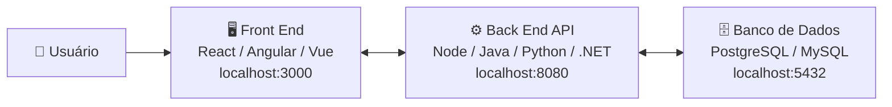
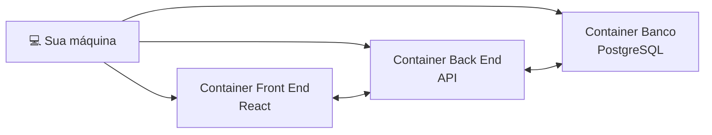
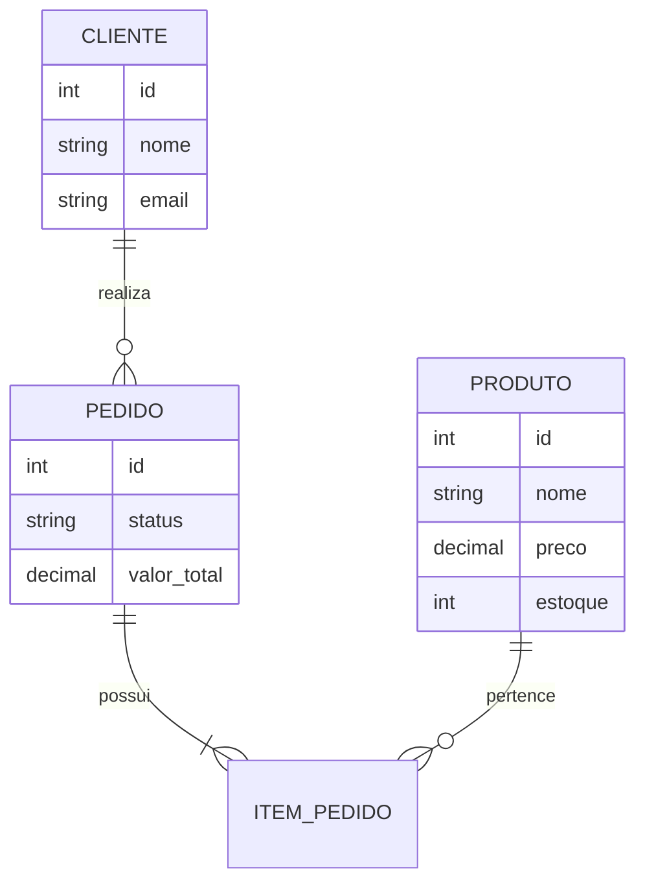
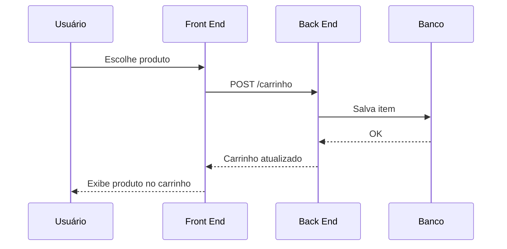

# On-Premises

Para começar **On-Premises**, a recomendação é manter uma arquitetura simples, mas já organizada como uma aplicação real. O ideal é separar **Front End**, **Back End** e **Banco de Dados**, mesmo rodando tudo na sua máquina.

Uma arquitetura inicial recomendada:



---

# Estrutura de pastas sugerida

Um projeto organizado poderia ficar assim:

```text
e-commerce/

├── frontend/
│   ├── src/
│   ├── components/
│   ├── pages/
│   ├── services/
│   └── package.json
│
├── backend/
│   ├── src/
│   │   ├── controllers/
│   │   ├── services/
│   │   ├── repositories/
│   │   ├── models/
│   │   └── routes/
│   └── package.json
│
├── database/
│   ├── migrations/
│   ├── scripts/
│   └── seed/
│
├── docker-compose.yml
│
└── README.md
```

---

# Rodando localmente com Docker (recomendado)

Mesmo sendo local, usar containers ajuda a deixar o ambiente parecido com produção.

Arquitetura:



---

# Exemplo de serviços locais

## Front End

```text
Tecnologia:
React + TypeScript

Executa:

http://localhost:3000
```

Responsabilidades:

* Telas.
* Componentes.
* Formulários.
* Validações de interface.
* Comunicação com API.

---

## Back End

```text
Tecnologia:
Node.js / Java / Python / .NET

Executa:

http://localhost:8080
```

Responsabilidades:

* Regras de negócio.
* Autenticação.
* Controle de pedidos.
* Integração com banco.

---

## Banco de Dados

Exemplo:

```text
PostgreSQL

localhost:5432
```

Tabelas iniciais:



---

# Exemplo com Docker Compose

Um ambiente local poderia subir tudo com:

```bash
docker compose up
```

Subindo:

```text
Frontend
   |
   ↓
Backend
   |
   ↓
PostgreSQL
```

Exemplo conceitual:

```yaml
services:

  frontend:
    image: ecommerce-frontend
    ports:
      - "3000:3000"

  backend:
    image: ecommerce-backend
    ports:
      - "8080:8080"

  database:
    image: postgres
    ports:
      - "5432:5432"
```

---

# Comunicação local

Fluxo de uma compra:



---

# Ferramentas para desenvolvimento local

## Código

* VS Code
* IntelliJ IDEA
* Visual Studio

## Versionamento

* Git
* GitHub/GitLab

## Banco

* DBeaver
* pgAdmin

## Testes API

* Postman
* Insomnia

## Testes Front End

* Jest/Vitest
* Cypress/Playwright

## Containers

* Docker Desktop

---

# Ambiente mínimo recomendado

Para um primeiro projeto:

```text
Frontend:
React + TypeScript
        |
        |
Backend:
Node.js + NestJS
        |
        |
Banco:
PostgreSQL
        |
        |
Ambiente:
Docker Compose
```

---

# Evolução natural

Começaria assim:

```text
LOCAL

Frontend
    |
Backend
    |
PostgreSQL


Depois:

Frontend
    |
API Container
    |
Banco Gerenciado


Depois:

Frontend CDN
    |
Load Balancer
    |
Múltiplas APIs
    |
Banco Escalável
```

Essa arquitetura local já ensina os conceitos que serão usados em produção: **separação de responsabilidades, APIs, banco isolado, containers, testes e preparação para deploy**.
