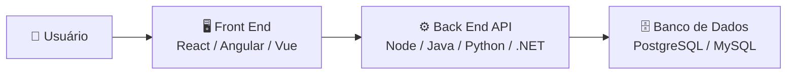
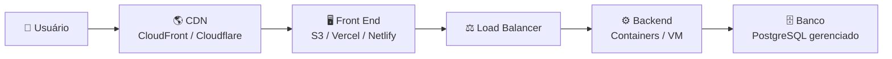
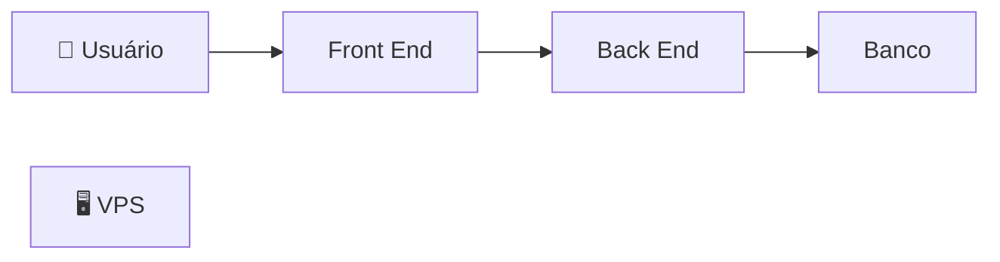
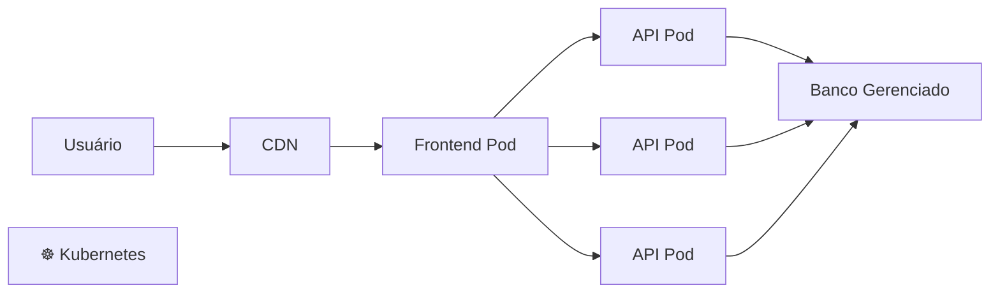
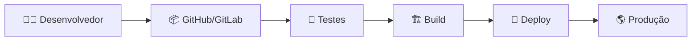
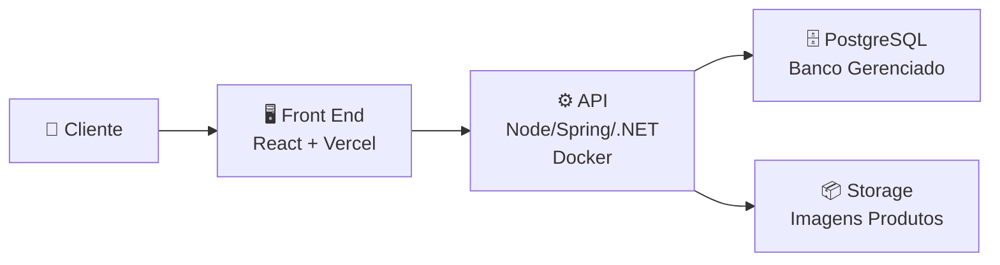

# Arquitetura

Para subir essa arquitetura de **e-commerce (Front End ↔ Back End ↔ Banco de Dados)**, você precisa escolher uma estratégia de infraestrutura. A escolha depende do tamanho do projeto, quantidade de usuários, orçamento e necessidade de escala.

Uma arquitetura simples pode ser publicada assim:



---

# Opção 1 — Cloud tradicional (mais comum em empresas)

Uma arquitetura profissional usando nuvem:



Componentes:

## Front End

Pode ser hospedado em:

* [Vercel](https://vercel.com?utm_source=chatgpt.com)
* [Netlify](https://www.netlify.com?utm_source=chatgpt.com)
* [Amazon S3](https://aws.amazon.com/s3/?utm_source=chatgpt.com)
* [Cloudflare Pages](https://pages.cloudflare.com?utm_source=chatgpt.com)

Fluxo:

```text
Código Front End
       |
       ▼
Build React/Vue/Angular
       |
       ▼
Hospedagem estática
       |
       ▼
Usuário acessa pelo navegador
```

---

# Back End / API

Pode ser executado em:

## Containers (recomendado)

Exemplo:

```text
Docker Container

API
 |
 ├── Node.js
 ├── Java Spring Boot
 ├── Python FastAPI
 └── .NET
```

Serviços comuns:

* [Amazon Elastic Container Service (ECS)](https://aws.amazon.com/ecs/?utm_source=chatgpt.com)
* [Google Cloud Run](https://cloud.google.com/run?utm_source=chatgpt.com)
* [Azure Container Apps](https://azure.microsoft.com/products/container-apps?utm_source=chatgpt.com)
* [Docker](https://www.docker.com?utm_source=chatgpt.com)

---

# Banco de Dados

Opções:

## Banco gerenciado (recomendado)

Você não administra servidor, apenas o banco.

Exemplos:

* [Amazon RDS](https://aws.amazon.com/rds/?utm_source=chatgpt.com)
* [Google Cloud SQL](https://cloud.google.com/sql?utm_source=chatgpt.com)
* [Azure Database for PostgreSQL](https://azure.microsoft.com/products/postgresql?utm_source=chatgpt.com)

Arquitetura:

```text
API

 |

Rede privada

 |

Banco PostgreSQL
```

---

# Opção 2 — Tudo em uma VPS (projeto pequeno)

Para estudo, MVP ou pequeno e-commerce:



Exemplo:

Uma máquina Linux:

```text
Servidor Ubuntu

├── Nginx
│
├── Front End
│
├── API
│
└── PostgreSQL
```

Provedores:

* [DigitalOcean](https://www.digitalocean.com?utm_source=chatgpt.com)
* [Hetzner](https://www.hetzner.com?utm_source=chatgpt.com)
* [Linode](https://www.linode.com?utm_source=chatgpt.com)

Vantagens:

✅ Mais barato
✅ Fácil de entender
✅ Bom para aprendizado

Desvantagens:

❌ Menor escala
❌ Você administra tudo

---

# Opção 3 — Kubernetes (grandes sistemas)

Para aplicações maiores:



Usado por sistemas com:

* Muitos usuários.
* Alta disponibilidade.
* Escalabilidade automática.

Serviços:

* [Amazon Elastic Kubernetes Service (EKS)](https://aws.amazon.com/eks/?utm_source=chatgpt.com)
* [Google Kubernetes Engine (GKE)](https://cloud.google.com/kubernetes-engine?utm_source=chatgpt.com)
* [Azure Kubernetes Service (AKS)](https://azure.microsoft.com/products/kubernetes-service?utm_source=chatgpt.com)

---

# Pipeline de publicação (CI/CD)

Em um ambiente profissional:



Ferramentas:

* [GitHub Actions](https://github.com/features/actions?utm_source=chatgpt.com)
* [GitLab CI/CD](https://docs.gitlab.com/ee/ci/?utm_source=chatgpt.com)
* Jenkins

---

# Arquitetura recomendada para começar um e-commerce

Para um projeto real de pequeno/médio porte:



Stack exemplo:

| Camada        | Tecnologia                    |
| ------------- | ----------------------------- |
| Front End     | React + TypeScript            |
| Hospedagem FE | Vercel                        |
| API           | Node.js/NestJS ou Java/Spring |
| Container     | Docker                        |
| Banco         | PostgreSQL                    |
| Imagens       | S3 ou similar                 |
| CI/CD         | GitHub Actions                |
| Monitoramento | Grafana + Prometheus          |

---

## Caminho recomendado de evolução

```text
Fase 1 - Aprendizado
VPS única
↓
Fase 2 - MVP
Frontend separado + API + Banco gerenciado
↓
Fase 3 - Produção
Containers + CI/CD + Monitoramento
↓
Fase 4 - Grande escala
Kubernetes + múltiplas instâncias
```

Para um primeiro e-commerce profissional, eu começaria com **Front End separado + API em Docker + Banco PostgreSQL gerenciado**, pois já segue padrões usados no mercado sem adicionar complexidade desnecessária.
