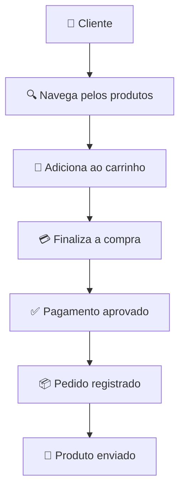
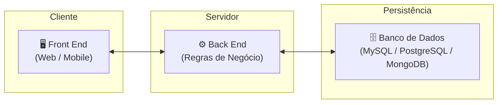

# E-COMMERCE

Um **e-commerce** (do inglês *electronic commerce*, ou **comércio eletrônico**) é um sistema que permite a compra e venda de produtos ou serviços pela internet.

Na prática, um e-commerce é composto por um conjunto de funcionalidades que viabilizam todo o processo de venda online, desde a navegação pelos produtos até a confirmação do pagamento e a entrega.

## Principais componentes de um e-commerce

* **Catálogo de produtos:** exibe os itens disponíveis, com fotos, descrições e preços.
* **Carrinho de compras:** permite selecionar e organizar os produtos antes da compra.
* **Cadastro e autenticação:** gerencia contas de clientes e login.
* **Processamento de pedidos:** registra e acompanha os pedidos realizados.
* **Pagamento:** integra com meios de pagamento, como cartão de crédito, PIX e boleto.
* **Estoque:** controla a disponibilidade dos produtos.
* **Entrega:** calcula frete e acompanha o envio.
* **Painel administrativo:** permite gerenciar produtos, pedidos, clientes e promoções.

## Exemplo de fluxo

## Exemplo de arquitetura simples

* **Front End:** interface que o cliente utiliza para navegar e comprar.
* **Back End:** implementa as regras de negócio, como autenticação, cálculo de frete, estoque e processamento de pedidos.
* **Banco de Dados:** armazena informações de clientes, produtos, pedidos e pagamentos.

Em resumo, um e-commerce é uma aplicação web (ou mobile) especializada em **comercializar produtos ou serviços online**, automatizando processos como catálogo, carrinho, pagamentos, estoque e gestão de pedidos.

## Criando o E-Commerce

- **Infra**
    - [On-Premises](./INFRA/On-Premises.md)
    - [Pública](./INFRA/publica.md)
- **Front End**
    - [O que é ?](./FE/)
    - [Regras de Negócio](./FE/regras.md)
    - [Acessibilidade](./FE/acessibilidade.md)
    - [Segurança](./FE/seguranca.md)
    - [Testes](./TESTES/FE/fe.md)

* **Back End**
    - [O que é ?](./BE/be.md)
    - [Regras de Negócio](./BE/regras.md)
    - [Segurança](./BE/seguranca.md)
    - [Testes](./TESTES/BE/api.md)

* **Banco de Dados**
    - [O que é ?](./DB/db.md)
    - [Segurança](./DB/seguranca.md)
    - [Testes](./TESTES/BD/db.md)
