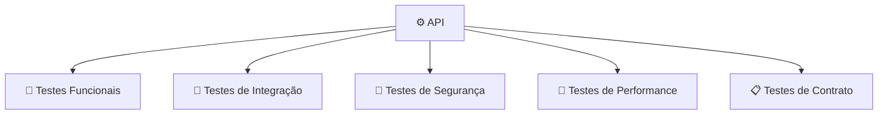
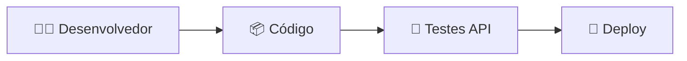

# Testes na API

Para realizar testes em uma **API**, você pode utilizar ferramentas e estratégias diferentes dependendo do objetivo: validar funcionamento, segurança, desempenho, integração ou comportamento em produção.

Os principais tipos de testes são:



---

# 1. Testes manuais de API

São usados para enviar requisições e verificar respostas.

## Postman

Uma das ferramentas mais utilizadas para testar APIs REST.

Permite:

* Criar requisições HTTP.
* Enviar parâmetros.
* Testar autenticação.
* Validar respostas JSON.
* Criar coleções de testes.
* Automatizar cenários.

Exemplo:

```http id="b1y3xp"
GET /produtos

Resposta esperada:

200 OK

[
  {
    "id": 1,
    "nome": "Notebook",
    "preco": 3500
  }
]
```

---

## Insomnia

Alternativa ao Postman.

Muito utilizada para:

* APIs REST.
* GraphQL.
* Testes rápidos de endpoints.

---

# 2. Testes automatizados

São testes executados automaticamente sempre que o código muda.

## Java / Spring Boot

Ferramentas comuns:

* JUnit.
* Mockito.
* Spring Test.

Exemplo de teste:

```text id="9c8klm"
Cenário:
Criar pedido

Entrada:
Produto disponível

Resultado esperado:
Pedido criado
Status 201
```

---

## Node.js / TypeScript

Ferramentas:

* Jest.
* Mocha.
* Supertest.

Exemplo:

```javascript id="33z1tp"
expect(response.status)
.toBe(201)
```

---

## Python

Ferramentas:

* Pytest.
* Requests.
* FastAPI TestClient.

---

# 3. Testes de contrato da API

Garantem que o Front End e outros consumidores recebam o formato esperado.

Exemplo:

A API promete:

```json id="m6v7w8"
{
  "id": 10,
  "nome": "Produto",
  "preco": 100
}
```

Um teste detecta se alguém alterou para:

```json id="b4k3zv"
{
  "codigo": 10,
  "descricao": "Produto"
}
```

Ferramentas:

* Pact.
* OpenAPI/Swagger.

---

# 4. Documentação e testes com OpenAPI

## Swagger UI

Permite:

* Documentar endpoints.
* Testar chamadas diretamente pelo navegador.
* Visualizar contratos da API.

Exemplo:

```text id="x9l6pn"
GET    /produtos
POST   /pedidos
PUT    /usuarios/{id}
DELETE /carrinho/{id}
```

---

# 5. Testes de segurança

Avaliam se a API possui vulnerabilidades.

Verificam:

* Autenticação.
* Permissões.
* SQL Injection.
* Exposição de dados.
* Tokens inválidos.

Ferramentas:

## OWASP ZAP

Usado para testes de segurança em aplicações web e APIs.

Exemplos de testes:

```text
Enviar token inválido
        ↓
API deve retornar 401

Acessar recurso sem permissão
        ↓
API deve retornar 403
```

---

# 6. Testes de carga e performance

Avaliam como a API se comporta com muitos usuários.

Exemplo:

```text
Usuários simultâneos: 10.000

Teste:
GET /produtos

Avaliar:
- Tempo de resposta
- Erros
- Consumo de recursos
```

Ferramentas:

## Apache JMeter

Usado para testes de carga e stress.

## k6

Muito usado em pipelines modernos de CI/CD.

---

# 7. Testes via linha de comando

## cURL

Útil para testes rápidos:

```bash id="u6s9m4"
curl -X GET \
https://api.exemplo.com/produtos
```

Enviar dados:

```bash id="pr4qf9"
curl -X POST \
-H "Content-Type: application/json" \
-d '{"produto":1,"quantidade":2}' \
https://api.exemplo.com/pedidos
```

---

# 8. Testes dentro do pipeline CI/CD

Em equipes profissionais, os testes rodam automaticamente:



Exemplos de ferramentas:

* GitHub Actions.
* GitLab CI/CD.
* Jenkins.
* Azure DevOps.

---

# Cenários importantes para um e-commerce

Uma API de e-commerce deveria testar:

| Funcionalidade | Teste                                      |
| -------------- | ------------------------------------------ |
| Login          | Usuário válido e inválido                  |
| Produtos       | Buscar produtos existentes                 |
| Estoque        | Impedir compra sem estoque                 |
| Carrinho       | Adicionar/remover produtos                 |
| Pedido         | Criar pedido corretamente                  |
| Pagamento      | Aprovação e rejeição                       |
| Permissões     | Cliente não acessar dados de outro cliente |
| Segurança      | Token expirado ou inválido                 |
| Performance    | Muitos acessos simultâneos                 |

---

## Stack de testes recomendada para um e-commerce

Uma combinação comum seria:

```text
Testes manuais:
→ Postman

Documentação:
→ Swagger/OpenAPI

Testes automatizados:
→ JUnit / Jest / Pytest

Segurança:
→ OWASP ZAP

Performance:
→ k6 ou JMeter

CI/CD:
→ GitHub Actions / GitLab CI
```

Em resumo: para começar, **Postman + Swagger + testes automatizados no próprio Back End** já cobrem a maior parte das necessidades de uma API de e-commerce. Para sistemas maiores, entram testes de segurança, carga e integração contínua.
