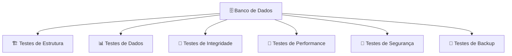
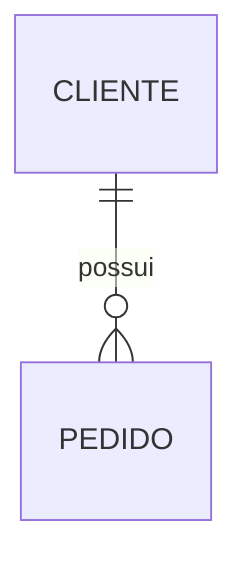
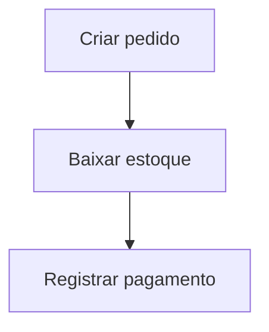
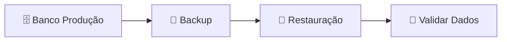
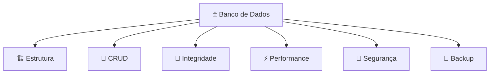

# Testes no Banco de Dados

Os testes no **Banco de Dados (BD)** têm como objetivo garantir que os dados sejam armazenados corretamente, que as regras de integridade sejam respeitadas, que as consultas tenham bom desempenho e que o banco esteja protegido contra falhas.

Em um e-commerce, os testes de banco validam principalmente:

* Estrutura das tabelas.
* Relacionamentos.
* Regras de integridade.
* Operações de leitura e escrita.
* Performance das consultas.
* Segurança dos dados.
* Backup e recuperação.



---

# 1. Testes de estrutura do banco

Validam se o banco foi criado corretamente.

Verificam:

* Tabelas existentes.
* Colunas.
* Tipos de dados.
* Índices.
* Constraints.
* Relacionamentos.

Exemplo:

Tabela `produto`:

```text
Produto
-----------------
id          INT
nome        VARCHAR
preco       DECIMAL
estoque     INT
```

Teste:

```text
✔ Campo preço existe
✔ Campo estoque é inteiro
✔ ID é chave primária
```

Ferramentas:

* Migrations do framework.
* Scripts SQL automatizados.
* Flyway.
* Liquibase.

---

# 2. Testes de CRUD

Validam as operações básicas:

* Create (Criar).
* Read (Consultar).
* Update (Atualizar).
* Delete (Excluir).

Exemplo:

Criar produto:

```sql
INSERT INTO produto
(nome, preco)
VALUES
('Notebook', 3500);
```

Validar:

```text
Produto criado corretamente
```

Atualizar:

```sql
UPDATE produto
SET preco = 3000
WHERE id = 1;
```

Validar:

```text
Preço atualizado
```

---

# 3. Testes de integridade dos dados

Garantem que o banco não aceite dados inválidos.

## Chave primária

Não permitir:

```text
Produto ID = 1
Produto ID = 1
```

---

## Chave estrangeira

Exemplo:



Teste:

```text
Criar pedido para cliente inexistente

Resultado esperado:
❌ Operação rejeitada
```

---

## Campos obrigatórios

Exemplo:

```sql
nome VARCHAR NOT NULL
```

Teste:

```json
{
 "nome": null
}
```

Resultado:

```text
❌ Registro recusado
```

---

# 4. Testes de regras de negócio no banco

Algumas regras podem estar diretamente no banco.

Exemplos:

* Estoque nunca pode ficar negativo.
* Pedido precisa ter cliente válido.
* Valor do pedido deve ser positivo.

Exemplo:

```text
Produto:
Estoque = 5

Venda:
Quantidade = 10

Resultado:
❌ Não permitir
```

---

# 5. Testes de transação

Garantem que operações complexas sejam completas ou totalmente revertidas.

Exemplo de compra:



Se o pagamento falhar:

```text
Pagamento falhou

Resultado esperado:

❌ Cancelar pedido
↩️ Restaurar estoque
```

Isso é controlado por transações:

```sql
BEGIN;

INSERT pedido;

UPDATE estoque;

COMMIT;
```

ou:

```sql
ROLLBACK;
```

---

# 6. Testes de performance

Avaliam se o banco suporta a carga esperada.

Testam:

* Consultas lentas.
* Índices.
* Grande volume de dados.
* Muitas conexões simultâneas.

Exemplo:

```text
Consulta:

Buscar produtos por categoria

Dados:
10 milhões de produtos

Resultado esperado:
Resposta rápida
```

Ferramentas:

* Apache JMeter.
* k6.
* pgbench (PostgreSQL).
* Scripts SQL personalizados.

---

# 7. Testes de consultas SQL

Validam se as consultas retornam os dados corretos.

Exemplo:

Consulta:

```sql
SELECT *
FROM pedidos
WHERE cliente_id = 10;
```

Teste:

```text
Cliente 10 possui:

Pedido 100
Pedido 101

Resultado esperado:

Retornar apenas esses pedidos
```

---

# 8. Testes de segurança do banco

Validam:

* Usuários e permissões.
* Acesso indevido.
* Exposição de dados.
* Criptografia.

Exemplo:

Usuário da aplicação:

```text
app_user
```

Tentativa:

```sql
DROP TABLE clientes;
```

Resultado esperado:

```text
❌ Permissão negada
```

---

# 9. Testes de backup e restauração

Não basta criar backups; é necessário validar a restauração.

Fluxo:



Teste:

```text
Backup realizado
↓
Banco restaurado
↓
Pedidos e clientes continuam existentes
```

---

# 10. Testes de migração

Garantem que alterações no banco não quebrem dados existentes.

Exemplo:

Antes:

```text
Cliente
- nome
- email
```

Alteração:

```text
Adicionar:
- telefone
```

Teste:

```text
Dados antigos continuam funcionando
Nova coluna criada corretamente
```

Ferramentas:

* Flyway.
* Liquibase.
* Prisma Migrate.
* Django Migrations.

---

# Ferramentas utilizadas para testes de Banco de Dados

| Objetivo            | Ferramentas          |
| ------------------- | -------------------- |
| Testes SQL          | Scripts SQL, DBeaver |
| Migrations          | Flyway, Liquibase    |
| PostgreSQL          | pgTAP                |
| Performance         | JMeter, k6, pgbench  |
| Automação           | JUnit, pytest, Jest  |
| Containers de teste | Testcontainers       |
| Monitoramento       | Prometheus, Grafana  |

---

# Exemplo de estratégia completa para um e-commerce



## Checklist básico

✅ Tabelas e relacionamentos validados
✅ Constraints funcionando
✅ CRUD testado
✅ Transações testadas
✅ Consultas críticas otimizadas
✅ Índices avaliados
✅ Permissões revisadas
✅ Backup restaurado com sucesso
✅ Migrações testadas
✅ Dados sensíveis protegidos

Em resumo: **testar o Banco de Dados garante que a aplicação não apenas funcione, mas que os dados permaneçam corretos, seguros, consistentes e disponíveis mesmo em cenários de erro ou alta demanda.**
