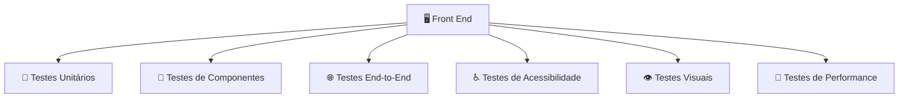
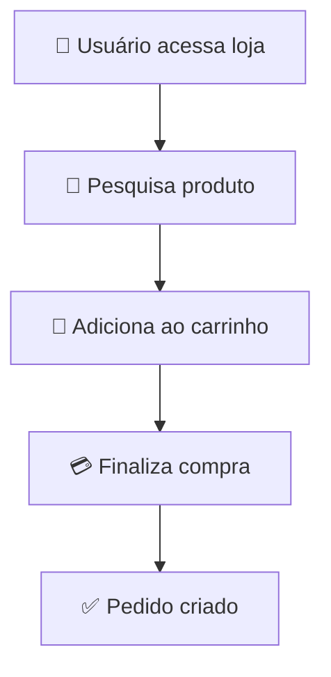
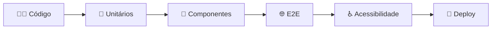

Para realizar testes no **Front End (FE)**, o objetivo é garantir que a interface funcione corretamente, seja acessível, tenha boa experiência de uso e continue funcionando após alterações no código.

Os testes de Front End normalmente são divididos em algumas categorias:



---

## 1. Testes unitários

Validam pequenas partes isoladas do código, como:

* Funções.
* Hooks.
* Regras de cálculo.
* Validações de formulário.

Exemplo em um e-commerce:

```text
Função:
calcularTotalCarrinho()

Entrada:
Produto R$100
Quantidade: 2

Resultado esperado:
R$200
```

Ferramentas comuns:

* Jest
* Vitest

Exemplo:

```javascript
test("calcula total do carrinho", () => {
  expect(calcularTotal([100, 50]))
    .toBe(150);
});
```

---

# 2. Testes de componentes

Validam componentes da interface.

Exemplos:

* Botão "Comprar".
* Card de produto.
* Menu.
* Formulário de login.
* Carrinho.

Ferramenta comum:

* React Testing Library

Exemplo:

```text
Componente:
Botão Comprar

Teste:
Usuário clica

Esperado:
Produto é adicionado ao carrinho
```

---

# 3. Testes End-to-End (E2E)

Simulam o comportamento real de um usuário navegando na aplicação.

Exemplo de fluxo:



Ferramentas:

* Cypress
* Playwright

Exemplo:

```text
Cenário:
Cliente compra um produto

Passos:
1. Abrir site
2. Fazer login
3. Escolher produto
4. Adicionar ao carrinho
5. Finalizar compra

Resultado:
Pedido aparece como criado
```

---

# 4. Testes de acessibilidade

Garantem que a aplicação possa ser utilizada por diferentes usuários.

Verificam:

* Contraste de cores.
* Textos alternativos.
* Navegação por teclado.
* Uso correto de HTML semântico.
* Compatibilidade com leitores de tela.

Ferramentas:

* axe DevTools
* Lighthouse.

Exemplo:

```text
Teste:

Imagem do produto

Esperado:


```

---

# 5. Testes visuais

Validam se a interface mudou visualmente de forma inesperada.

Exemplo:

Antes:

```text
[ Produto ]
[ R$100 ]
[ Comprar ]
```

Depois de uma alteração:

```text
[ Produto ]
[ R$100
[ Comprar ]
```

O teste detecta a quebra visual.

Ferramentas:

* Percy
* Chromatic

---

# 6. Testes de responsividade

Verificam o comportamento em diferentes dispositivos:

* Desktop.
* Tablet.
* Celular.

Exemplo:

```text
Desktop:

Produto | Produto | Produto


Mobile:

Produto
Produto
Produto
```

Ferramentas:

* DevTools do navegador.
* Playwright.
* Cypress.

---

# 7. Testes de performance

Avaliam:

* Tempo de carregamento.
* Tamanho dos arquivos.
* Uso de memória.
* Velocidade de renderização.

Ferramentas:

* Lighthouse.
* WebPageTest.

Exemplos de métricas:

```text
First Contentful Paint
Largest Contentful Paint
Cumulative Layout Shift
```

---

# 8. Testes de integração com a API

Validam se o Front End conversa corretamente com o Back End.

Exemplo:

```text
Front End:

GET /produtos

API retorna:

[
 {
  nome:"Notebook"
 }
]

Esperado:

Produto aparece na tela
```

Ferramentas:

* Mock Service Worker (MSW).
* Cypress.
* Playwright.

---

# 9. Testes de estados de erro

O Front End também deve lidar com falhas.

Exemplos:

API indisponível:

```text
❌ Não foi possível carregar produtos.
Tente novamente.
```

Pagamento recusado:

```text
❌ Pagamento não aprovado.
Escolha outra forma de pagamento.
```

---

# Pipeline de testes do Front End



---

## Stack de testes recomendada para um e-commerce Front End

| Objetivo         | Ferramenta                 |
| ---------------- | -------------------------- |
| Testes unitários | Jest / Vitest              |
| Componentes      | React Testing Library      |
| Testes E2E       | Cypress / Playwright       |
| Acessibilidade   | Lighthouse / axe           |
| Visual           | Percy / Chromatic          |
| Performance      | Lighthouse                 |
| CI/CD            | GitHub Actions / GitLab CI |

---

Para um e-commerce moderno, uma boa cobertura costuma combinar:

**Vitest/Jest → componentes e lógica**
**React Testing Library → interface**
**Playwright/Cypress → jornadas completas de compra**
**Lighthouse/axe → acessibilidade e qualidade**

Assim você testa desde uma pequena função até o fluxo completo: **entrar na loja → escolher produto → comprar → confirmar pedido**.
